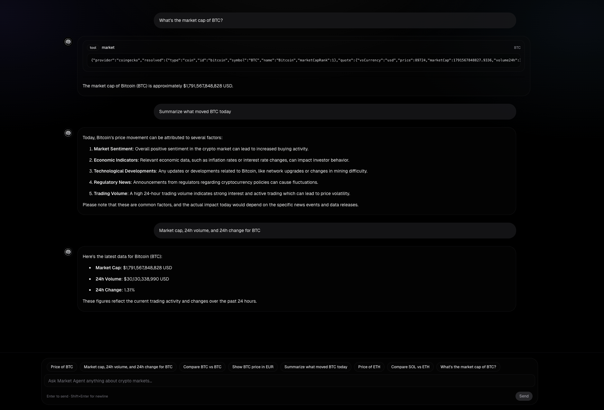

## Market Agent Starter (Next.js + AI SDK)

This repo is a minimal, **educational starter** for building an interactive “agent + tools + UI” loop using:

- **Next.js App Router** (UI + API route)
- **AI SDK** (`ai`, `@ai-sdk/react`, `@ai-sdk/openai`) for streaming UI messages + tool calls
- A **ToolLoopAgent** that can call tools to fetch external market data
- A small **tool UI renderer** that shows tool progress/output inside the chat

It’s intentionally small so you can fork it and create your own custom variant (different models, tools, schemas, UI, and routing).

---

## What you get

- **Chat UI** (Vercel-ish dark, mobile-first) with a fixed composer + suggestion pills (`app/page.tsx`, `components/chat-input.tsx`)
- **Tool UI** that renders tool progress/output inline as “cards” (`components/market-view.tsx`)
- **Single API endpoint** that streams agent UI messages (`app/api/chat/route.ts`)
- **Agent definition** with tools and model selection (`agent/market-agent.tsx`)
- **Market tool** hitting CoinGecko’s public endpoints (`tool/market-tool.ts`)

---

## UI preview



---

## How it works (end-to-end)

### 1) UI sends chat messages

`app/page.tsx` uses `useChat()` from `@ai-sdk/react`. By default it POSTs to **`/api/chat`** with `{ messages }`, and receives a streaming response of UI message “parts” (text, step markers, tool calls).

### 2) API streams the agent’s UI response

`app/api/chat/route.ts` passes the incoming `messages` to `createAgentUIStreamResponse({ agent, uiMessages })`, which streams back UI-friendly message parts.

### 3) Agent chooses when to call tools

`agent/market-agent.tsx` defines a `ToolLoopAgent` that uses an OpenAI model and a `tools` map:

- Tool name: `market`
- Tool implementation: `marketTool`

The agent can emit normal text **and** invoke tools during its reasoning loop.

### 4) Tools stream progress + output

`tool/market-tool.ts` defines a streaming tool via `tool({ inputSchema, execute })`:

- `inputSchema`: validates tool inputs with `zod`
- `execute`: is an async generator (`async *`) that can yield intermediate states

This tool yields `{ state: "loading" }` first, then `{ state: "ready", marketData: "..." }`.

### 5) UI renders tool calls in the chat

When the agent calls `market`, `useChat()` receives a message part like `tool-market`. `app/page.tsx` routes those parts into `components/market-view.tsx`, which renders:

- input streaming/available (the tool is about to run)
- output available (loading/ready)
- output error

---

## Prerequisites

- Node.js (modern LTS recommended)
- **Bun** (recommended) or npm/pnpm/yarn
- An OpenAI API key (or swap provider/model; see below)

---

## Setup

### 1) Install dependencies

Using Bun:

```bash
bun install
```

Using npm:

```bash
npm install
```

### 2) Configure environment variables

Create `.env.local`:

```bash
OPENAI_API_KEY=your_key_here
```

Notes:

- The OpenAI provider reads `OPENAI_API_KEY` from the environment.
- The included market tool uses CoinGecko’s **public** endpoints (no key in this starter), but you may hit rate limits. If you plan to ship, add caching and/or use an authenticated market data provider.

### 3) Run the dev server

```bash
bun dev
```

Then open `http://localhost:3000`.

---

## Quick usage examples

Try prompts like:

- “What’s the price of ETH in USD?”
- “Get market data for BTC.”
- “Fetch the market data for 0x… on base” (contract address flow)

---

## Customization guide (build your own variant)

### Change the model

Edit `agent/market-agent.tsx`:

- Swap `openai("gpt-4o")` to a different model string
- Or switch providers entirely (e.g. another AI SDK provider package)

Keep the rest of the architecture the same.

### Add a new tool (recommended learning path)

1. **Create a tool file** (e.g. `tool/news-tool.ts`)

   - Define `tool({ description, inputSchema, execute })`
   - Use `zod` to validate inputs
   - Yield intermediate states if you want progressive UI updates

2. **Register the tool on the agent**

In `agent/market-agent.tsx`, add it to `tools`:

- `tools: { market: marketTool, news: newsTool }`

3. **Render it in the UI**

In `app/page.tsx`, add a new `case "tool-news": ...` and create a renderer component similar to `components/market-view.tsx`.

### Extend the existing `market` tool

`tool/market-tool.ts` already demonstrates two resolution strategies:

- Token **contract address** (EVM-style `0x...`) + `chain` → CoinGecko platform endpoint
- Token **symbol/name** → CoinGecko search → coin id → price endpoint

Common extensions:

- Add more chains to `CHAIN_TO_COINGECKO_PLATFORM_ID`
- Add more output fields (e.g. ATH/ATL, sparkline, etc.)
- Add caching (server-side) if you hit rate limits
- Return structured JSON (object) instead of stringifying, then render richer UI in `MarketView`

### Customize the chat UI

Key files:

- `app/page.tsx`: chat shell (header/content/footer), message loop + routing message “parts”, builds dynamic suggestion prompts
- `components/chat-input.tsx`: composer (`textarea`), Enter-to-send, and optional suggestion pills
- `components/market-view.tsx`: tool output display
- `app/globals.css`: global styling (Tailwind)

---

## Project structure

```text
app/
  api/chat/route.ts      # POST /api/chat → streams agent UI response
  globals.css            # global theme + markdown tweaks
  layout.tsx             # app shell + fonts
  page.tsx               # Chat UI using useChat()
agent/
  market-agent.tsx       # ToolLoopAgent definition (model + tools)
tool/
  market-tool.ts         # Streaming tool (zod schema + execute generator)
components/
  chat-input.tsx         # Chat input component
  market-view.tsx        # Tool invocation renderer
public/
  assets/
    chat-conversation.png
  logo.png
```

---

## Scripts

```bash
bun dev     # run locally
bun build   # production build
bun start   # run production server
bun lint    # lint
```

---

## Deployment notes

This is a standard Next.js App Router project. On Vercel (or similar), ensure:

- `OPENAI_API_KEY` is set in your deployment environment
- Your chosen model/provider is supported in the runtime you deploy to

---

## Troubleshooting

### Chat input is disabled / can’t send messages

- **Cause**: `useChat()` disables input unless `status === "ready"`.
- **Fix**:
  - Make sure the dev server is running (`bun dev`) and the page loads without errors.
  - If it becomes stuck after an error, refresh the page to reset state.

### 401/403 or “Unauthorized” from the model provider

- **Cause**: Missing or invalid `OPENAI_API_KEY`.
- **Fix**:
  - Add `OPENAI_API_KEY=...` to `.env.local`.
  - **Restart** the dev server after changing env vars.
  - If deployed, set the env var in your hosting provider’s environment settings.

### The assistant responds, but tools fail (error shown in red)

- **Cause**: The tool threw an error (network failure, bad input, provider response not OK).
- **Fix**:
  - Try a simpler input like `ETH` or `BTC`.
  - For contract addresses, ensure it’s a valid EVM `0x...` address and choose a supported `chain`.
  - Check the server console for the full error message.

### CoinGecko rate limits / 429 responses

- **Cause**: CoinGecko’s public endpoints can rate-limit.
- **Fix**:
  - Add server-side caching (recommended) or backoff/retry logic.
  - Consider switching to an authenticated market data provider for production usage.

### Tool output looks like a JSON string

- **Cause**: `marketTool` currently returns `marketData` as `JSON.stringify(...)` and `MarketView` renders it directly.
- **Fix**:
  - Return a structured object from the tool and render a richer UI in `components/market-view.tsx`.

---

## License

MIT
